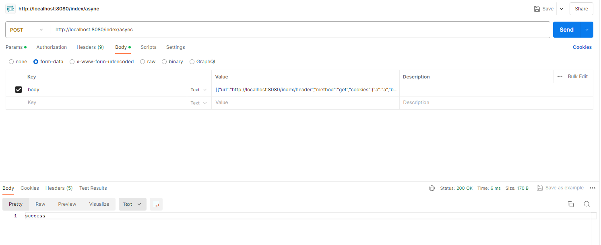
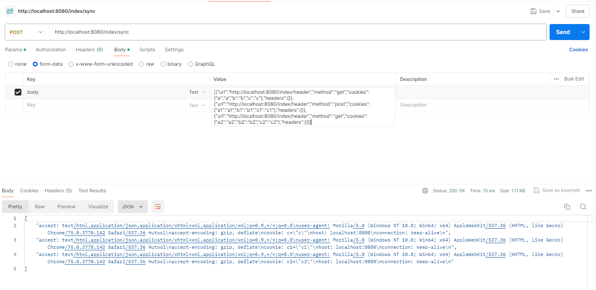

# 多线程请求小工具(处理接口慢，从而切割成多个接口进行请求，提高请求速度)
 ## 异步多线程请求
    curl -X POST http://localhost:8080/index/async -F "body=[{\"url\":\"http://localhost:8080/index/header\",\"method\":\"get\",\"cookies\":{\"a\":\"a\",\"b\":\"b\",\"c\":\"c\"},\"headers\":{}},{\"url\":\"http://localhost:8080/index/header\",\"method\":\"post\",\"cookies\":{\"a1\":\"a1\",\"b1\":\"b1\",\"c1\":\"c1\"},\"headers\":{}},{\"url\":\"http://localhost:8080/index/header\",\"method\":\"get\",\"cookies\":{\"a2\":\"a2\",\"b2\":\"b2\",\"c2\":\"c2\"},\"headers\":{}}]"
   ### 效果图
   
 ## 同步多线程请求
    curl -X POST http://localhost:8080/index/sync -F "body=[{\"url\":\"http://localhost:8080/index/header\",\"method\":\"get\",\"cookies\":{\"a\":\"a\",\"b\":\"b\",\"c\":\"c\"},\"headers\":{}},{\"url\":\"http://localhost:8080/index/header\",\"method\":\"post\",\"cookies\":{\"a1\":\"a1\",\"b1\":\"b1\",\"c1\":\"c1\"},\"headers\":{}},{\"url\":\"http://localhost:8080/index/header\",\"method\":\"get\",\"cookies\":{\"a2\":\"a2\",\"b2\":\"b2\",\"c2\":\"c2\"},\"headers\":{}}]"
   ### 效果图
   
## docker运行
```shell
docker build -f Dockerfile -t testjava:1.0 .
docker run -d -p 8080:8080 --name testjava testjava:1.0
```